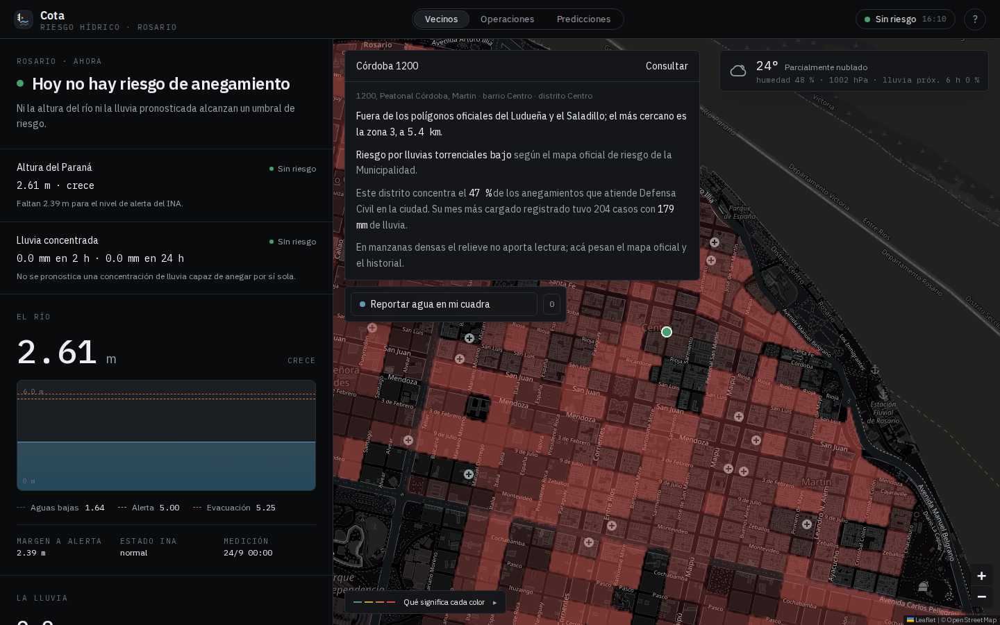
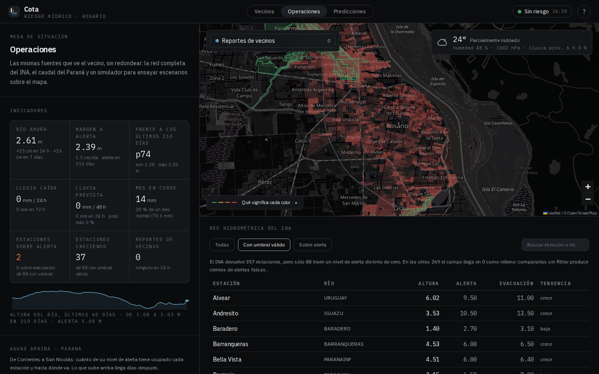
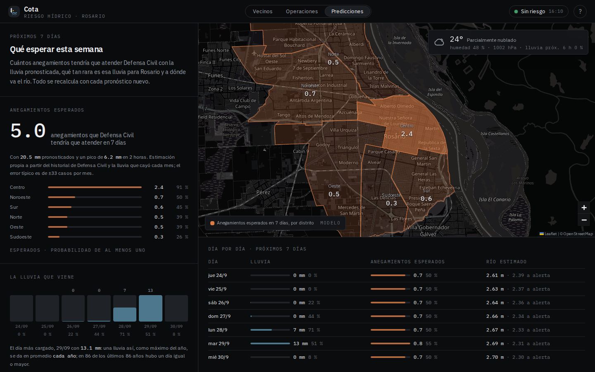

<p align="center">
  
</p>

<h1 align="center">Cota · riesgo hídrico de Rosario</h1>

<p align="center">
  ¿Hay hoy riesgo de que el agua entre a las casas o corte las calles, y dónde?<br/>
  Un panel que cruza datos públicos y verificables en un semáforo de cuatro niveles, con cada número enlazado a su origen.
</p>

<p align="center">
  <a href="https://cota.pegasustudio.com">cota.pegasustudio.com</a> ·
  <a href="https://cota.pegasustudio.com/como-funciona">cómo funciona</a> ·
  <a href="https://cota.pegasustudio.com/api/estado">/api/estado</a>
</p>

<p align="center">
  
  
  
  
  
</p>

<p align="center">
  
</p>

---

## Qué hace

Cota no inventa ningún número. Toma lo que ya publican el Instituto Nacional del Agua, Open-Meteo, Copernicus y la Municipalidad de Rosario, lo cruza y lo explica en lenguaje llano. Cuando una fuente no responde, el bloque queda vacío y avisa; nunca rellena con un dato viejo ni pone "sin riesgo" por falta de datos.

| Vista | Para quién | Qué ofrece |
|---|---|---|
| **Vecinos** `/` | Cualquier persona | Semáforo del día con su motivo · buscador de dirección (zona oficial, riesgo por lluvias, historial del distrito, relieve) · reportes de vecinos estilo Waze · clima actual · consejos según el nivel |
| **Operaciones** `/operaciones` | Defensa Civil, distritos, prensa | Qué hacer ahora: recomendaciones por reglas con su porqué y parte de situación copiable · indicadores · Paraná aguas arriba de Corrientes a San Nicolás · simulador que pinta el mapa · red completa del INA (357 estaciones) · caudal |
| **Predicciones** `/predicciones` | Mirar la semana | Anegamientos esperados por distrito y día · qué tan rara es la lluvia prevista · a dónde va el río |
| **Cómo funciona** `/como-funciona` | Todos | Presentación de 16 diapositivas: conceptos en criollo, fuentes, herramientas, preguntas frecuentes |

<p align="center">
  
  
</p>

## De dónde sale cada dato

| Fuente | Qué aporta | Cadencia |
|---|---|---|
| **INA** · GeoServer WFS público | Altura del Paraná en Rosario, tendencia, niveles oficiales de alerta y evacuación, red de 357 estaciones | Una lectura diaria en Rosario · en vivo |
| **Open-Meteo** | Lluvia pronosticada hora por hora, clima actual, lluvia caída (modelo) | Cada hora · en vivo |
| **GloFAS** · Copernicus vía Open-Meteo | Caudal del Paraná, 210 días atrás y 7 adelante | Diario · en vivo |
| **ERA5** vía Open-Meteo | Lluvia diaria y horaria desde 1940, para climatología y extremos | Hasta el día actual |
| **Municipalidad de Rosario** · datos abiertos | 87 polígonos oficiales de áreas inundables (Ludueña y Saladillo), distritos, barrios, intervenciones de Defensa Civil por distrito y mes | Capas fijas · registro hasta donde el municipio publicó |
| **Municipalidad de Rosario** · InfoMapa | Mapa de Riesgo Climático 2024: afectación a vivienda por lluvias torrenciales, por radio censal | Capa fija |
| **Mapzen Terrain Tiles** | Modelo propio de puntos bajos del terreno · marcado como modelo | Capa fija |

Todo el detalle técnico (fórmulas, umbrales, endpoints, vigencia de cada dato) está al pie de cada vista en un bloque "Documentación" colapsado, y en los JSON públicos `/api/estado`, `/api/predicciones`, `/api/kpis`, `/api/recomendaciones` y `/api/reportes`.

## Cómo se decide el nivel

El nivel general es el peor de dos factores. **Río:** la altura de hoy contra los niveles de alerta (5,00 m) y evacuación (5,25 m) que fija el INA para Rosario. **Lluvia concentrada:** la ventana de dos horas más cargada del pronóstico contra umbrales de 15 / 25 / 30 mm; esos umbrales son una estimación de este panel y están marcados como tales. Las 87 zonas oficiales se pintan con ese nivel, ponderado por su sensibilidad a la lluvia.

## Predicciones

Tres modelos ajustados con `npm run build:data` y evaluados en cada pedido con el pronóstico del momento. Cada uno publica su ajuste y su error.

- **Anegamientos** · regresión de Poisson de las intervenciones mensuales de Defensa Civil contra la lluvia horaria de ERA5. Se prueban tres variables (total, pico de 2 h, ambas) y gana la que mejor predice meses que no vio; cualquier ajuste con coeficiente negativo se descarta. Se aplica a los 7 días de pronóstico y se reparte por distrito y por día.
- **Lluvia extrema** · Gumbel sobre el máximo diario de cada año desde 1940: período de retorno del día más cargado del pronóstico y cuantiles de 2 a 100 años.
- **Río** · tendencia de mínimos cuadrados sobre 14 días (ritmo, días hasta alerta) y curva altura–caudal `h = a + b·ln(Q)` contra GloFAS buscando el mejor desfase de 0 a 10 días; cuando el ajuste es débil la página lo dice.

## Reportes de vecinos

Cualquiera puede marcar en el mapa dónde ve agua (calle anegada, agua en viviendas, desagüe tapado, calle cortada), sin cuenta. Los reportes duran 24 h, se pueden confirmar y aparecen como gotas de color. Se validan contra los límites de Rosario y 140 caracteres, llevan un campo trampa y cada conexión puede cargar 5 reportes y 20 confirmaciones por hora. Son una señal, no un dato oficial.

## Correr en local

```bash
npm install
npm run build:data     # descarga y procesa las capas → public/data (ya vienen versionadas)
npm run dev            # http://localhost:3000
```

Producción:

```bash
npm run build && npm start -- -p 3000
```

O con Docker (imagen `node:22-alpine`, Next en modo standalone, reportes persistidos en el volumen `/data`):

```bash
docker build -t cota .
docker run -p 3000:3000 -v cota-data:/data cota
```

## Deploy

Cada push a `main` corre CI (`tsc` + `eslint`) y dispara el deploy en EasyPanel a través del hook guardado en el secret `EASYPANEL_DEPLOY_HOOK`. La app vive en `cota.pegasustudio.com` detrás de Cloudflare.

## Datos y sus trampas

Cosas que costaron encontrar y conviene saber antes de tocar los scripts:

- El INA no tiene API pública documentada; el GeoServer WFS sí funciona (`public2:ultimas_alturas_con_timeseries`). 265 de sus 357 estaciones publican `nivel_de_alerta: 0` como relleno: los umbrales sólo se comparan cuando son mayores a cero. Tarda proporcional a los días pedidos (14 ≈ 3 s, 210 ≈ 55 s) y a veces cae con `pool error`; por eso la serie larga se versiona como instantánea y se fusiona con los últimos 14 días en vivo.
- GloFAS en las coordenadas del centro de Rosario devuelve 0,03 m³/s (celda sin cauce); se consulta la celda del canal (−32,975 / −60,675).
- El archivo municipal de áreas inundables se llama "Saladillo" pero tres cuartos de sus polígonos son del Ludueña.
- El mapa de riesgo climático no está en el portal de datos abiertos: vive en el WMS de InfoMapa, sin `GetFeatureInfo` ni WFS y con `GetMap` limitado a 2048 px. Se rasteriza, se rellenan los contornos y se reproyecta fila por fila a Mercator para poder consultarlo por dirección.
- Las intervenciones de Defensa Civil vienen por distrito y mes, publicadas hasta enero de 2024; el archivo 2021 usa otro formato y al 2022 le falta diciembre.
- El modelo de terreno usa la **mediana** del entorno, no la media: SRTM mide techos, y con la media una calle plana del microcentro leía 3 m "por debajo" de las torres de al lado. En manzanas densas no da lectura y lo dice.
- La IDE provincial y la capa de desagües de InfoMapa existen, pero no tienen datos dentro de Rosario.

## Estructura

```
scripts/           build:data → polígonos, terreno, riesgo climático, Defensa Civil, modelos, serie del río
src/app/           vistas (/, /operaciones, /predicciones, /como-funciona) y rutas /api
src/lib/           fuentes (river, rain, weather), riesgo, modelos (forecast/), kpis, reportes, lookup
src/components/    mapa, bottom sheet, deck de la guía, kpis, reportes
src/content/       textos de la guía
public/data/       capas procesadas, versionadas
```

## Licencia

MIT. Los datos pertenecen a sus organismos y se citan en cada vista.

Cota no es un servicio oficial de alerta. Ante una emergencia, Defensa Civil **103**.
